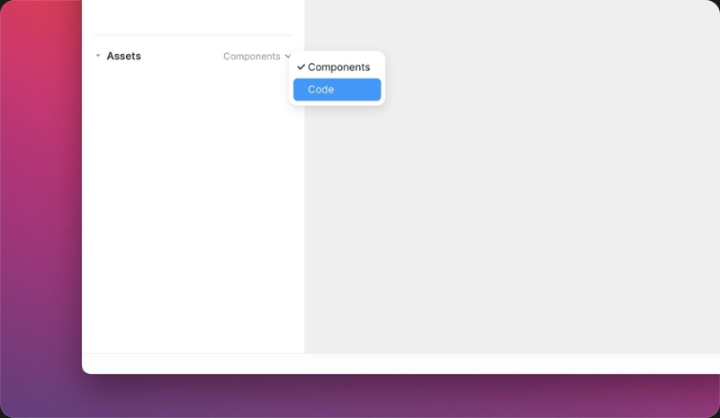

> Framer의 내장 코드 에디터에서 바로
> 유연한 React 컴포넌트를 작성해보세요.

코드 컴포넌트는 캔버스 위에 어떤 React 컴포넌트라도 직접 렌더링해 Framer의 기능을 확장시켜줄 수 있습니다. Framer는 Framer에서 바로 코드 컴포넌트를 작성하게 도와줄 내장 코드 에디터를 갖추고 있습니다.

코드 컴포넌트를 통해, 여러분은 [오디오와 비디오 같은 미디어를 위한 컴포넌트](https://www.framer.com/), 카운터나 슬라이더 같은 고급 UI 컴포넌트, 지도 또는 API를 위한 커스텀 컴포넌트 등 여러 컴포넌트를 구축할 수 있습니다.

### 캔버스 위의 React

Framer는 [React로 인터랙티브한 컴포넌트를 만드는데](https://www.framer.com/) 여러분이 필요로 하는 모든 것을 갖추고 있습니다. 여러분은 일반적인 React 컴포넌트를 작성하고 여러분이 웹에서 할 수 있는 것은 무엇이든지 구축할 수 있습니다. 덕분에 여러분은 컴포넌트를 이용해 Framer의 기능성을 확장시키고 캔버스에서 이를 디자인할 때 바로 가져다 쓸 수 있습니다.

## 기본 사용법

새 코드 컴포넌트를 만들려면, Assets 패널의 “Code” 옵션을 선택한 뒤 “Create Code File” 버튼을 클릭하세요. 그러면 React 컴포넌트 모듈 하나를 export하는 새 코드 파일이 나타납니다.



Assets 드랍다운

여러분의 컴포넌트를 편집하면서 실시간 프리뷰를 보려면, 우상단 preview 버튼을 클릭하세요. 여러분이 작업 중인 작업물의 분할 프리뷰 화면을 볼 수 있습니다.

## 코드 예시

여기 아주 간단하게 만들 수 있는 바닐라 React 버튼 컴포넌트가 있습니다.

```jsx
export default function Button(props) {
  return <div>Hello</div>;
}
```

여기에서 한 단계 더 나아가 인라인 style 객체를 이용하는 React의 표준 방식을 통해 버튼 컴포넌트를 스타일링해봅시다.

```jsx
export default function Button(props) {
  const style = {
    display: "inline-block",
    backgroundColor: "orange",
    padding: 8,
  };

  return <div style={style}>Hello</div>;
}
```

이제, 인터페이스를 통해 설정을 변경할 수 있는 title prop을 추가해봅시다.

```jsx
import { addPropertyControls, ControlType } from "framer";

export default function Button(props) {
  const style = {
    display: "inline-block",
    backgroundColor: "orange",
    padding: 8,
  };

  return <div style={style}>{props.text}</div>;
}

Button.defaultProps = {
  text: "My Title",
};

addPropertyControls(Button, {
  text: {
    title: "Text",
    type: ControlType.String,
  },
});
```

그러면 여러분은 캔버스 위에 간단하고 설정 가능한 React 컴포넌트를 얻게 됐습니다. 하지만 여러분이 같은 개념을 적용해 원하는 React 컴포넌트를 만들 수 있는 방법을 알게 되기를 바랍니다.


Text prop 컨트롤

## Prop 컨트롤

Framer의 스마트 컴포넌트처럼, 여러분의 코드 컴포넌트에도 prop을 변경하고 업데이트하기 위한 특별한 UI를 제공하는 Prop 컨트롤이 나타나게 할 수 있습니다.

코드 컴포넌트가 Prop 컨트롤을 갖추고 있다면, 헤더에 컴포넌트 이름이 적힌 섹션에 Prop 패널에 여러분의 컨트롤 목록이 나타날 것입니다.

더 많은 내용을 원하시면, [코드 컴포넌트에서 Prop 컨트롤을 사용하는 방법](https://www.framer.com/learn/)에 대한 저희의 가이드 문서를 참조하세요.

여러분이 React를 이해하는데 어려움을 겪고 계시다면, 저희가 여러분을 위해 써놓은 책 한 권이 있습니다! [Framer를 위한 React 가이드](https://www.framer.com/books/framer-guide-to-react/)는 React에 대해 충분히 학습할 수 있는 완벽한 자료입니다. 이 자료는 디자이너의 관점에서 작성됐으며, 처음 자신만의 코드 컴포넌트를 만들 때 여러분이 알고 싶어하는 모든 것들이 준비돼 있습니다.

## 내장 Framer Motion

Framer Motion은 모든 Framer 프로젝트에 기본적으로 내장돼 있습니다. 이는 선택사항이지만, 컴포넌트의 어떤 요소에 애니메이션을 적용할 때 쓰기 좋습니다. 코드 컴포넌트에서 Framer Motion을 사용하기 위해서는 간단히 import문을 추가하고 Framer Motion API에서 여러분이 필요로하는 모듈을 import하면 됩니다.

```jsx
import { motion, useMotionValue } from "framer-motion";
```
